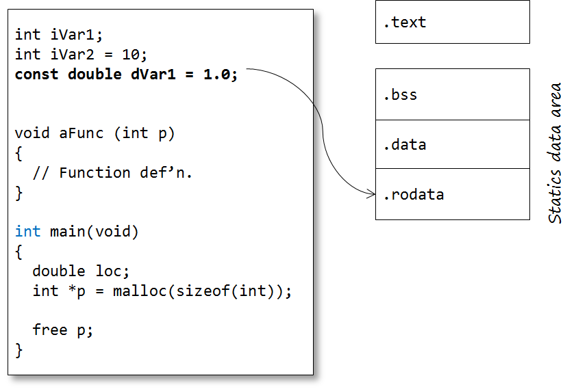
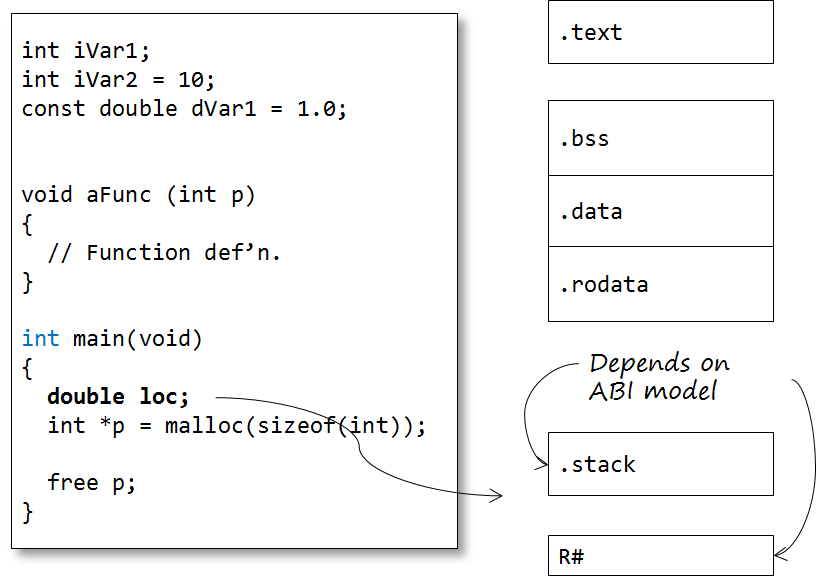
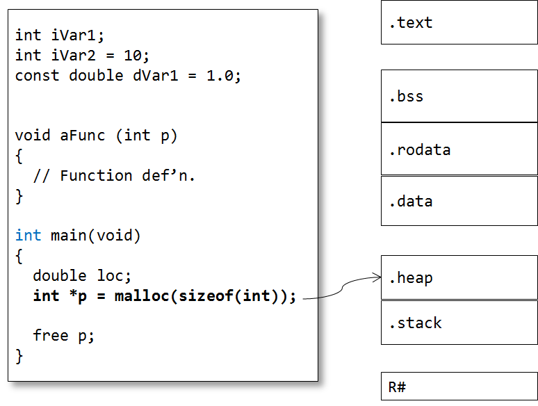
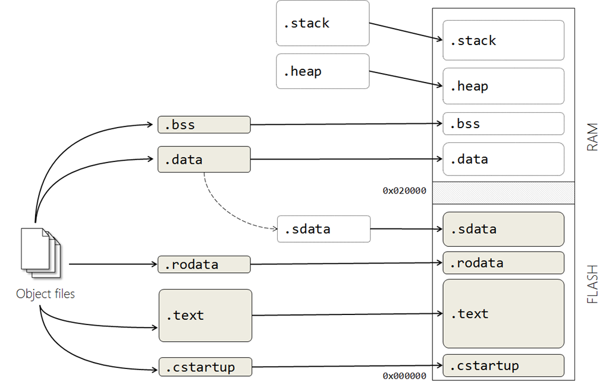
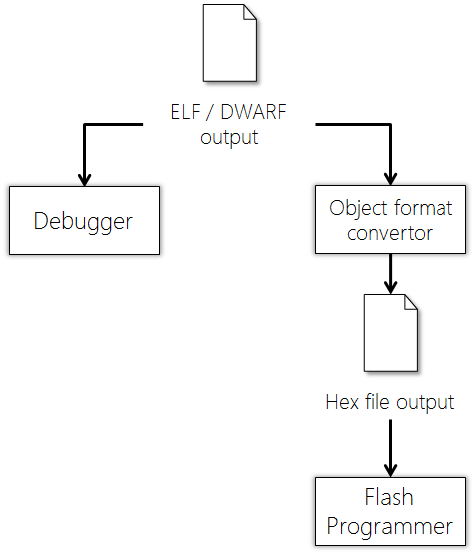

# ex2

- 指標指常數字串

```c
#include <stdio.h>
#include <stdlib.h>
#include <string.h>

int main(int argc, char* argv[])
{
    // c_pointer 指標指向是常數字串無法修改字串
    char* c_pointer = "hello";
    // c_array 是一塊記憶體裡面存放hello 字串可以修改因為有塊真正記憶體空間
    char c_array[10] = "hello";

    printf("%s\n", c_pointer);
    printf("%s\n", c_array);
    // c_pointer[0] = 'a'; 無法編譯過因為指標指向是唯讀常數字串空間

    // 初始化後不能指向用 = 號 assign 字串必須 , c_array = "world"; 這樣編譯過不了必須像下面這樣一個個填進去或是用strcpy
    c_array[0] = 'w';
    c_array[1] = 'o';
    c_array[2] = 'r';
    c_array[3] = 'l';
    c_array[4] = 'd';
    // 用 strcpy
    // strcpy(c_array, "world");
    printf("%s\n", c_array);

    // 使用動態記憶體配置10 byte 讓 c_pointer指向這塊 malloc 出來記憶體空間的起始位置
    c_pointer = (char*) malloc(sizeof(char) * 10);
    strcpy(c_pointer, "hello");
    printf("%s\n", c_pointer);

    return 0;
}

```

Code









## Reference 
https://blog.feabhas.com/2012/06/the-c-build-process/