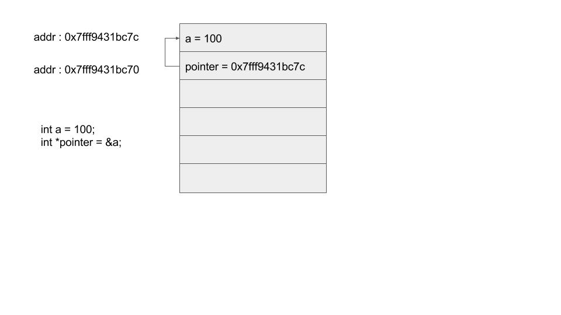
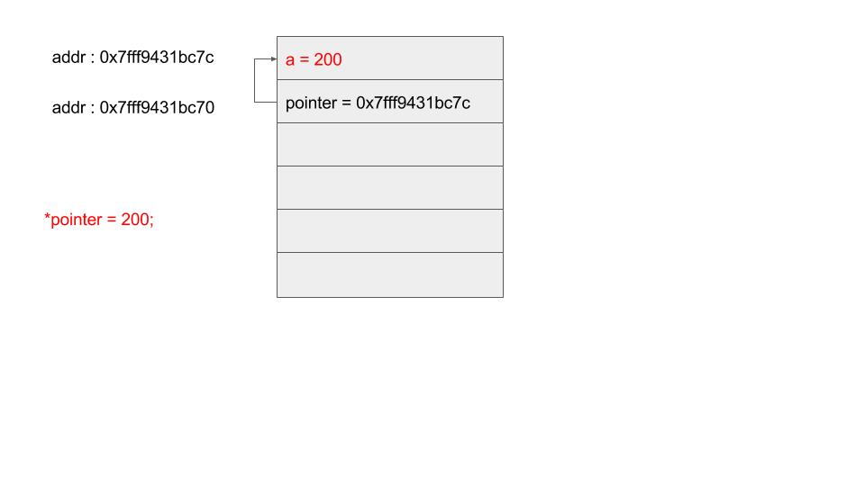

# pointer


##指標基本五個要點:
```
1. 指標也是一塊記憶體數 , 跟一般變數區別只是在於它是拿來存放某塊記憶體位址
2.指標要搞懂指標根本型態
3.指向的型態
4.指標offset(偏移長度）
5.等號兩邊型態必須要一致才可以assign 不然編譯會發出警告, 這規則一般型態也是一樣
```

以下面例子來解釋

int a = 100;  // a 變數是個int 型態, assign 100 到這塊記憶體
int *pointer = &a;  // pointer 變數是個指標 , 型態是 int* ; 那第五要點提到等號左右兩邊必須要一樣型態才可以 assign , 既然 pointer變數型態是int*
那代表 &a 也要是 int* , 加上& 之後a 變數要退化一個維度,這概念你可以先背起來 , 所以&a 型態就變成 int* 符合第五個要素, 編譯就不發出警告


```c
#include <stdio.h>

int main(int argc, char *argv[])
{

    int a = 100;
    int *pointer = &a;

    printf("%d\n",a);
    printf("%p\n",(void*)&a);
    *pointer = 200;
    printf("%p\n",(void*)pointer);
    printf("%p\n",(void*)&pointer);
    printf("%d\n",a);

    return 0;
}
```





