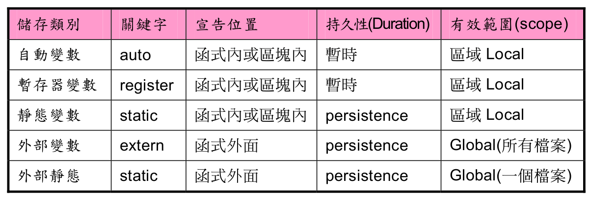

# Scope & Duration





```c
#include <stdio.h>

int a = 100;
static int b = 200;

int test1()
{
    int a = 0;
    static int b = 100;

    printf("%p\n", (void*)&a);
    printf("%p\n", (void*)&b);

    printf("%d\n", a++);
    printf("%d\n", b++);

    return 0;
}

int test2() {

    int a = 11;
    int b = 0;

    printf("%p\n", (void*)&a);
    printf("%p\n", (void*)&b);

    printf("%d\n", a++);
    printf("%d\n", b++);

    return 0;
}

int main(int argc, char *argv[])
{
    int a = 88, i;

    printf("%p\n", (void*)&a);
    printf("%p\n", (void*)&b);
    printf("%d\n", a++);
    printf("%d\n", b++);

    for (i = 0; i < 3; ++i) {
        test1();
    }

    {
        int a;
        int b;

        for (i = 0; i < 2; ++i) {
            test2();
        }

        printf("%p\n", (void*)&a);
        printf("%p\n", (void*)&b);
        printf("%d\n", a++);
        printf("%d\n", b++);
    }

    printf("%p\n", (void*)&a);
    printf("%p\n", (void*)&b);
    printf("%d\n", a++);
    printf("%d\n", b++);

    return 0;
}


```
