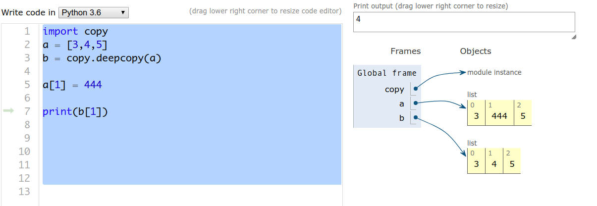

# 常用


##`Python都是物件` 或說是把任何資料包裝成物件，以型別區分

## `python assign 決定class 型態  ***重要概念***`

```py
a = 1  # class int 型態
a = 1.1  # class float 型態
a = 'hello'  # class str 型態
```


## Print a string as hex bytes
```py
For Python 2.x:
':'.join(x.encode('hex') for x in 'Hello World!')

The code above will not work with Python 3.x, for 3.x, the code below will work:
':'.join(hex(ord(x))[2:] for x in '中文')

hex(ord('中'))  # python3 str 預設是  unicode 編碼
```

```py
In [25]: text = '中文'   # python3 str 預設是  unicode 編碼
In [26]: b_str = text.encode('big5') # 轉成 bytes 
In [27]: b_str
Out[27]: b'\xa4\xa4\xa4\xe5'  
In [31]: unicode_str = b_str.decode('big5')  # 從 big5 的 byts decode 回 str  python3 str 預設是  unicode 編碼
In [32]: unicode_str
Out[33]: '中文'
In [34]: ':'.join(hex(ord(x))[2:] for x in unicode_str)  # 查看 unicode bytes 格式
Out[34]: '4e2d:6587'
```


## Python五種基本資料結構型態 list set dictionary tuple string `只有list 可變` 


- 不可變(mutable) :建立之後,其值就不會改變。如「 3 + 5 」會建立新int物件
- 不可變: int、float、str、tuple
- 可變(immutable):建立後,其內容仍可改變   ex : 可變:list


Python中的元組(Tuple)類似於Java中的陣列,一旦新增了一個 tuple，就`不能以任何方式改變它`。

`string是一種不可變的數據 跟 tuple 一樣是不可變動`


列表(list) 列表是Python中最具靈活性的`有序集合物件類型`,與字串不同的是,列表可以包含任何種類的物件:數字,字串,甚至是其他列表.並且列表都是可變物件,它支持在原處修改的操作.也可以通過指定的索引和分片獲取元素.列表就可元組的可變版本.


##`深拷貝`，完全拷貝了一個副本，容器內部元素`地址都不一樣`
### 談談python中的深拷貝和淺拷貝
https://zhuanlan.zhihu.com/p/25221086


```py
import copy
a = [3,4,5]
b = copy.deepcopy(a)
a[1] = 444
print(b[1])
```

下面的使用`deepcopy` 產生兩塊不同記憶體




python中的深拷貝和淺拷貝和java裡面的概念是一樣的，所謂`淺拷貝就是對引用的拷貝`(同塊記憶體位址)，
所謂`深拷貝就是對對象的資源的拷貝`。


Python程式的基本執行單位是`「模組」`,簡單 地說就是`Python程式檔案`  # 重要

最小的執行單位是`「述句」`,述句可由分號「;」隔開,但非必要


（`[:]則是作淺層複製`，只不過對`字串這種不可變動的物件沒有實質意義`）

###`[::-1]` 表示從索引0至結尾，以負偏移1方式取得字串，結果就是`反轉字串。 # 技巧重要`

- 反轉字串

```py
In [1]: s = 'hello'

In [2]: s
Out[2]: 'hello'

In [3]: s = s[::-1]

In [4]: s
Out[4]: 'olleh'
```


```py
>>>type(None)
<class 'NoneType'>

表示該值是一個空對象，空值是Python裡一個特殊的值，用None表示。
None不能理解為0，因為0是有意義的，而None是一個特殊的空值。

>>>type('')
<class ''str'>
```

你可以將None賦值給任何變量，也可以將任何變量賦值給一個None值得對象


## 成員關係運算子

成員關係運算子`「in、not in」, 檢查某物件(元素)是否在容器裡`  # 常用
```py
In [9]: a = [3,5,6,7,8]

In [10]: 3 in a
Out[10]: True

In [11]: 1 in a
Out[11]: False
```


同等關係運算子`「is、is not」,檢查兩個名稱是否指向同一個物件` # 常用 id() 驗證是不是指向同個記憶體位址

```py
In [12]: a = 3

In [13]: b = 3

In [14]: a is b
Out[14]: True

In [15]: id(a)
Out[15]: 94578995706432

In [16]: id(b)
Out[16]: 94578995706432

In [17]: c = 5

In [18]: a is c
Out[18]: False

In [19]: id(c)
Out[19]: 94578995706496
```
### 分清	==	與	is	的適用場景
is	表示的是對象標示符(object	identity),而	`==	表示的意思是相等(equal)`。`is`	的作用是
用來檢查對象的標示符是否一致的,也就是比較`兩個對象在內存中是否擁有同一塊內存空
間`,它並不適合用來判斷兩個字符串是否相等。


###  '0'為真  not 後為假  `因為'0' 等於acsii 48 所以為真`

```sh
None、0、0.0、空字串「''」、空list或空tuple
(或空的容器),會被當做「False」(假)   其餘皆會被當做「True」(真)
```
- 驗證測試

```py
not 0       # True 
not 0.0     # True
not ''      # True 空字串
not ()      # True
not []      # True
not {}      # True
not set()   # True
```

型別NoneType,唯一值None
None用來代表:沒有、尚未定義、無效


x = 100; y = 50
bigger = x if x > y else y


###找出三數字之最大的那一個

```py
a, b, c = 3, 5, 7; x = None
(c if b < c else b) if a < b else (c if a < c else a)
```

上下等價
```py
a, b, c = 3, 5, 7; x = None
if a < b:
    if b < c:
        x = c
    else:
        x = b
else:
    if a < c:
        x = c
    else:
        x = a
```


##del述句:刪除名稱,連帶刪除與 物件之間的綁定關係
垃圾收集機制(garbage collection)
```py
>>> a = 3
>>> del a
Traceback (most recent call last):
File "<stdin>", line 1, in <module>
NameError: name 'a' is not defined
```


## for loop and while loop `等價可互相模擬對方`只是應用點不同
```py
i = 1
x = 0
while i <= 100:
    x += i
    i += 1
print(x)
```
```py
x = 0
for i in range(1,101):
    x += i
    i += 1
print(x)
```


所謂「能提供一串東西的物件」,目前僅知是 `list、tuple、str, dict` 後續再詳細介紹

```py
for 名稱 in `能提供一串東西的物件`:
    述句
```

- dict for loop

```py
d = {'x': 1, 'y': 2, 'z': 3} 
for key in d:
    print key, 'corresponds to', d[key]
```

- list for loop

```py
l = [34,6,7,8,9]
for item in l:
    print(item)
```


###內建函式range 
```py
range(3)產生出"物件", 能提供0、1、2
```


###break述句:

`立即跳出迴圈(最近的那一層)`

```py
scores = (98, 87, 59, 64, 77)
# 預設All Pass
all_pass = True

for x in scores:
    if x < 60:
        all_pass = False 
        break

if all_pass:
    print('passed')
else:
    print('no all pass')
```


### continue述句:
`跳到下一輪`

```py
# 算大於60的平均
scores = (55, 73, 81, 65, 95, 34)
n = 0
high_total = 0

for x in scores:
    if x < 60:
        continue

    n += 1
    high_total += x

high_total /= n

print(high_total)
```

## `編碼 !!! 重要`

這是因為 Python 3.x 中，python 直譯器預期的 .py 編碼，`預設是 UTF-8`，而在 Ubuntu 15.10 中，預設採用的文字編碼也是 UTF-8，這時在 .py 檔案中撰寫中文，並不會有問題發生，然而，你知道在 Windows 中，使用記事本編輯文字檔案時，預設的文字編碼是什麼嗎？


### 關於Python腳本開頭兩行的

http://www.itread01.com/content/1501168823.html

有順序問題必須要下面這樣
```py
#!/usr/bin/python
# -*- coding: utf-8 -*-
```

```py
#!/usr/bin/python
```

是用來說明腳本語言是 python 的 是要用 /usr/bin下面的程序（工具）python，這個解釋器，來解釋 python 腳本，來運行 python 腳本的。

```py
2、# -*- coding: utf-8 -*-
```

是用來指定文件編碼為 utf-8 的 , 


### 具體如何聲明python文件編碼？
對此格式的詳細解釋是：

如果沒有此文件編碼類型的聲明，則 `python2 默認以ASCII編碼去處理`；如果你沒聲明編碼，但是文件中又包含非ASCII編碼的字符的話，`python解析器去解析` 的 `python 文件`，自然就會報錯了。
必須放在python文件的第一行或第二行


## 開檔讀取寫入


Python使用open()打開檔案
```py
f = open('檔案', '模式')
```

模式有

```py
r - 讀取(檔案需存在)
w - 新建檔案寫入(檔案可不存在，若存在則清空)
a - 資料附加到舊檔案後面(遊標指在EOF)
r+ - 讀取舊資料並寫入(檔案需存在且遊標指在開頭)
w+ - 清空檔案內容，新寫入的東西可在讀出(檔案可不存在，會自行新增)
a+ - 資料附加到舊檔案後面(遊標指在EOF)，可讀取資料
b - 二進位模式
```


Python 逐行讀取檔案內容

```py
#!/usr/bin/python
 
## Open file
fp = open('filename.txt', "r")
line = fp.readline()
 
## 用 while 逐行讀取檔案內容，直至檔案結尾
while line:
    print(line)
    line = fp.readline()
 
fp.close()
```

## 使用 with as

```py
#!/usr/bin/python 
with open('filename.txt') as fp:
     all_lines = fp.readlines()
```

with之後的運算式傳回的物件，可以使用as指定給變數來參考，在上面的例子中，file所參考到的物件，最後會被自動關閉，即使在with as的區塊中發生了例外，`最後一定會關閉file所參考的物件`。


Python 與中文處理
http://web.ntnu.edu.tw/~samtseng/present/Python_and_Chinese.pdf


測試檔案中文文字是`Big5編碼`

ubuntu內建的`文字編輯器gedit存檔時選檔案->另存新檔->字元編碼->繁體中文(big5)`


###在 Python 程式中，讀入中文文字檔案時，要事`先知道該檔案的編碼方式`，才能正確讀取。例如：

```py
file_big5 = open('Big5File.txt', 'r', encoding='big5') 
file1_big5 = open('Big5File1.txt', 'w', encoding='big5') 
file_utf8 = open("UTF8File.txt", "w", encoding="utf-8")

for line in file_big5:
    print(line) # line 是 str 型態python3預設 unicode
    print(line.encode('utf-8'))
    file_utf8.write(line)
    file1_big5.write(line)

file_big5.close()
file1_big5.close()
file_utf8.close()

with open("Big5File.txt", 'r', encoding='big5') as fp:
    for line in fp:
        print(line)
```


## 物件導向三大特色

https://kaochenlong.com/2011/10/13/python-oop/

1. 資料封裝(Encapsulation)

   簡單講，資料封裝就是將資料分成私用(Private)、保護(Protected)、公用(Public)等，實踐 Information hiding 概念, `避免程式各個物件互相干擾`，降低程式的複雜度及維護上的困難度。

2. 繼承(Inheritance)

   有繼承的關係後，父類別 (Super class) 中的資料 (Data) 或方法 (Method) 在次子類(Subclass)就可以繼承使用，次子類別的次子類別也可以繼承使用，最後即能達到資料重覆使用的目的。

3. 多型(Polymorphism)

   多型(Polymorphism) 代表能夠在執行階段，物件能夠依照不同情況變換資料型態，換句話說，多型是指一個物件參考可以在不同環境下，扮演不同角色的特性，指向不同的物件實體，可 透過實作多個繼承或介面來實現父類別，並使用Override或Overload來達成。


封裝、繼承、多型為物件導向三大基礎 。 `此三者具有次序性 ， 沒有封裝就不可能有繼承 、沒有繼承就不可能有多型`。

封裝 (encapsulation) 的目的是將 Class 裡的屬性用 private 隱藏，只能透過public的方法存取資料。
`(隱藏程式細節，避免直接處理造成的困擾。使開發與維護更容易)`

繼承 (Inheritance) 的目的，是要達到「程式碼再用」(Code Rause) 或「介面再用」。
透過繼承，可以適當的切割類別，`並在衍生類別中重複使用、擴充和修改基底類別中定義的行為，又不破壞原先基底類別設計`。

多型 (Polymorphism) 指的是不同型態的物件，定義相同的操作介面，由於被呼叫者 (Callee) 有著相同的介面，呼叫者並不用指定特別型別，只需針對介面進行操作，實際執行的物件則在runtime決定，藉此增加程式碼的彈性。

##何謂物件（Object）？
https://developer.mozilla.org/zh-TW/docs/Learn/Drafts/Python/Quickly_Learn_Object_Oriented_Programming

創建物件就像是創造你自己的變數型別（variable type）。

這個物件可以包含好幾個變數（稱為屬性，attributes/properties），裡面儲存不同型別的資料。這個物件也可以包含已經自己設定好的函式（稱為 methods），用於操作物件的屬性。

你可以用`同一個型別去創建很多個物件（同一個類別），每個物件都有屬於自己的數值`。

###類別（ Class ），就是一個抽象的`模板`，

###`實例(Instance)` 就是根據這個模板創造出來的資訊，像是王先生、蔡小姐等具體的對象，每個對象擁有`相同的方法`，但是各自所擁有的`資料能不同`。

```py
class BankAccount:
    """ Class for Bank Accounts"""
    # The __data is private 
    __data = 100
    __userName = ''
    __balance = 0
    type = 'Normal Account'    # variable shared by all objects of the class

    # 這個特殊的方法 __init__() 會在物件被創見時自動執行。
    def __init__(self, name, balance):
        # default variables unique to each object:
        self.__userName = name
        self.__balance = balance

    def __del__(self):
        print("Goodbye Python!")

    # Object Methods:
    def showBalance(self):
        print(self.__balance)
        return

    def withdrawMoney(self, amount):
        self.__balance -= amount
        return

    def depositMoney(self, amount):
        self.__balance += amount
        return

    # 對外窗口取得 private data 
    def getData(self):
        return self.__data

    def showUserName(self):
        print(self.__userName)

    def showBalance(self):
        print(self.__balance)

if __name__ == '__main__':
    jason_yao_instance = BankAccount("Jason Yao", 10000)    # create new instance of ClassName
    adan_yao_instance = BankAccount("Adan Yao", 20000)    # create another instance

    # access object properties
    jason_yao_instance.showUserName()#print(jason_yao_instance.__userName)   #'Im 1'
    adan_yao_instance.showUserName()#print(adan_yao_instance.__userName)    #'Me 2'

    # access object methods
    jason_yao_instance.depositMoney(100)
    adan_yao_instance.depositMoney(200)

    jason_yao_instance.showBalance()#print(jason_yao_instance.__balance)   # 'Im 1'
    adan_yao_instance.showBalance()#print(adan_yao_instance.__balance)    # 'Me 2'

    # same as:
    print(jason_yao_instance.type)    # 'Normal Account'
    print(adan_yao_instance.type)    # 'Normal Account'

    print(jason_yao_instance.getData())    # 'Normal Account'
    print(adan_yao_instance.getData())    # 'Normal Account'

    print(id(jason_yao_instance))
    print(id(adan_yao_instance))

```

## python 物件導向「Class 」與「Instance」
物件導向第一個特性：封裝
物件導向的一個重要的特點就是`封裝`。

在上面 Animal 的這個類別當中，每個實例就擁有自己的 Name 、 sound 、 age 這些資訊，我們可以通過一些函數來呼叫這些資訊，舉例來說，想要聽到這個動物的叫聲:
print(Dog.sound)


```py
# -*- coding: utf-8 -*-
# -*- coding: utf-8 -*-
class Animal(object):
    """
    宣告一個抽象的類別 Animal 
    """
    # __init__是 python 當中的一個特殊方法，可以在一開始時，就將這個累所需要的屬性綁定，我們稱之為初始化
    def __init__(self, age, sound, name):
        """
        假設動物有三種屬性，年齡，叫聲，姓名，當然你也可以舉更多屬性
        """
        self.age = age
        self.sound = sound
        self.__name = name

    # 初始化屬性之後，動物可能會有一些動作，我們可以把它看成物件導向當中的方法（ Method ）
    def run(self):
        '''動物跑步的方法'''
        pass

    def Animal_sounds(self):
        '''動物叫的方法'''
        print("叫聲:" + self.sound)

    def showName(self):
        print(self.__name)

    def showAge(self):
        print(self.age)

if __name__ == '__main__':
    # 這樣我們就創造了一隻 叫做 jj 的狗 ，年齡是 18 歲，叫的聲音是 wof
    Dog = Animal('8', '汪', '拉西') # The Dog is instance
    Dog.Animal_sounds()
    Dog.showName()
    Dog.showAge()

    Cat = Animal('5', '喵', '病貓')
    Cat.Animal_sounds()
    Cat.showName()
    Cat.showAge()

```


### 繼承例子

```py
# -*- coding: utf-8 -*-
class Animal(object):
    """
    宣告一個抽象的類別 Animal 
    """
    # __init__是 python 當中的一個特殊方法，可以在一開始時，就將這個累所需要的屬性綁定，我們稱之為初始化
    def __init__(self, age, sound, name):
        """
        假設動物有三種屬性，年齡，叫聲，姓名，當然你也可以舉更多屬性
        """
        self.age = age
        self.sound = sound
        self.__name = name

    # 初始化屬性之後，動物可能會有一些動作，我們可以把它看成物件導向當中的方法（ Method ）
    def run(self):
        '''動物跑步的方法'''
        pass

    def Animal_sounds(self):
        '''動物叫的方法'''
        print("叫聲:" + self.sound)

    def showName(self):
        print(self.__name)

    def showAge(self):
        print(self.age)

class Dog(Animal):
    def __init__(self, age, sound, name, run_):
        super(Dog, self).__init__(age, sound, name) # 呼叫父類別__init__()
        self.__run = run_

    def run(self):
        print(self.__run)

class Fish(Animal):
    def __init__(self, age, sound, name, run_):
        super(Fish, self).__init__(age, sound, name) # 呼叫父類別__init__()
        self.__run = run_

    def run(self):
        print(self.__run)

if __name__ == '__main__':
    dog = Dog(10, '旺', '拉西', '跑')
    fish = Fish(5, '', '食人魚', '遊')

    dog.Animal_sounds()
    dog.showName()
    dog.showAge()
    dog.run()

    fish.Animal_sounds()
    fish.showName()
    fish.showAge()
    fish.run()
```


#### 深入 super()


看了上面的使用，你可能會覺得 super 的使用很簡單，無非就是獲取了父類，並調用父類的方法。其實，在上面的情況下，super 獲得的類剛好是父類，但在其他情況就不一定了，super 其實和父類沒有實質性的關聯。

讓我們看一個稍微複雜的例子，涉及到多重繼承，代碼如下：

```py
class Base(object):
    def __init__(self):
        print("enter Base")
        print("leave Base")

class A(Base):
    def __init__(self):
        print("enter A")
        super(A, self).__init__()
        print("leave A")

class B(Base):
    def __init__(self):
        print("enter B")
        super(B, self).__init__()
        print("leave B")

class C(A, B):
    def __init__(self):
        print("enter C")
        super(C, self).__init__()
        print("leave C")


c = C()
```

其中，Base 是父類，A, B 繼承自 Base, C 繼承自 A, B，它們的繼承關係是一個典型的『菱形繼承』，如下：

```sh
      Base
      /  \
     /    \
    A      B
     \    /
      \  /
       C
```
現在，讓我們看一下使用：


```sh
enter C
enter A
enter B
enter Base
leave Base
leave B
leave A
leave C
```


### 多型

```py
class Demo:
    def __init__(self, i):
        self.i = i
     
    def __str__(self):
        return str(self.i)
          
    def hello(self):
        print("hello " + self.__str__())
 
class SubDemo1(Demo):
    def __init__(self, i, j):
        super().__init__(i)
        self.j = j
     
    def __str__(self):
        return super().__str__() + str(self.j)
 
class SubDemo2(Demo):
    def __init__(self, i, j):
        super().__init__(i)
        self.j = j
        self.k = str(self.i) + str(self.j)
     
    def __str__(self):
        return self.k
 
a = SubDemo1(22, 33)
b = SubDemo2(44, "55")
a.hello()
b.hello()
```


SubDemo1 與 SubDemo2 繼承 (inherit) 自 Demo ，因此兩個子類別也都繼承了 hello() 方法 (method) ，雖然 SubDemo1 與 SubDemo2 所建立的物件各自是不同型態，然而由繼承關係兩種型態可通用 hello() 。

### 在如何確定一個物體的大小？


答案，"只使用 sys.getsizeof"不是完全完整的答案。
這對於直接的內置對象是有效的，但它並不解釋它們可能包含什麼，特別是數字和字元串之外的類型。


## 模組
###Python 程式裡的 __name__ 可以用來分辨程式是直接執行還是被 import 的

`角色不同`

原來如果一個 python script 是被別的 python script `當成 module 來 import 的話`，那麼這個被 import 的 python script 的 __name__ 就會是那個 python script 的名稱。而如果這個 python script 是`直接被執行的話，__name__ 就會是 __main__`。


### 關於Import中的路徑搜索問題

```py
In [10]: import  sys

In [11]:  print(sys.path)
['', '/home/shihyu/anaconda3/bin', '/home/shihyu/anaconda3/lib/python36.zip', '/home/shihyu/anaconda3/lib/python3.6', '/home/shihyu/anaconda3/lib/python3.6/lib-dynload', '/home/shihyu/anaconda3/lib/python3.6/site-packages', '/home/shihyu/anaconda3/lib/python3.6/site-packages/IPython/extensions', '/home/shihyu/.ipython']
```

```py
if __name__ == '__main__':
    doSomething()
```

#### Python	提供了	3	種方式來引入外部模塊: 	import語句、from...	import...及__import__函數。
	
其中較為常見的為前面兩種,而	 	__import__	 	函數與	 	import	 	語句類似,
不同點在於前者顯式地將模塊的名稱作為字符串傳遞並賦值給命名空間的變量。
在使用import的時候注意以下幾點:

- 一般情況下儘量優先使用	 	import	a	 	形式
- 有節制地使用	 	from	a	import	B	 	形式
- 儘量避免使用	 	from	a	import	*	 ,`因為這會汙染命名空間`

#### from os.path import *, from os.path import join, import os 差異

- from os.path import join , os.path下的join函數直接使用

```py
from os.path import join
#join = 10 ## 衝到一樣名稱
print(join('C:\\windows', 'system32'))
```

- from os.path import * , os.path 底下所有函數直接使用

```py
from os.path import ＊
#join = 10 ## 衝到一樣名稱
print(join('C:\\windows', 'system32'))
```

- import os , 建議都使用這個避免變數名稱衝突

```py
import os
join = 10
print(join)
print(os.path.join('C:\\windows', 'system32'))
```
Python 提供的 module（模組）與 package（套件）是建立架構的基本元件，但在module之間為了重複使用一些 function（函數）或 class（類別）而必須互相 import（匯入），使用上一個不注意就會掉入混亂的 import 陷阱。

```sh
sample_package/
├── __init__.py
├── sample_module.py
└── sample_module_import.py
```

```py
from sample_module import sample_func
if __name__ == '__main__':
    sample_func()
```

在 Python 中，import、import as 與 from import 是陳述句，可以出現在程式中陳述句可出現的任何位置，它們基本上用來在現有範疇（Scope）中匯入、設定名稱空間，舉例來說，如果先前程式範例是撰寫於 xmath.py 檔案中，那麼以下是一些 import、import as 與 from import 的使用實例，假設這些程式是撰寫在與 xmath.py 相同目錄的另一個 .py 檔案：


- xmath.py

```py
def max(a, b):
    return a if a > b else b
def min(a, b):
    return a if a < b else b

def sum(*numbers): # numbers 接受可變長度引數
    total = 0
    for number in numbers:
        total += number
    return total

pi = 3.141592653589793
e = 2.718281828459045
```

```py
import xmath
print '# import xmath'
print xmath.pi
print xmath.max(10, 5)
print xmath.sum(1, 2, 3, 4, 5)
 
print '# import xmath as math'
import xmath as math # 為 xmath 模組取別名為 math
print math.e
 
print '# from xmath import min'
from xmath import min  # 將 min 複製至目前模組，不建議 from modu import *，易造成名稱衝突
print min(10, 5)
```

## 函數

#### 不定長度引數
事先可能不知道要傳入的引數個數，可以在定義函式的參數時使用`*`，表示該參數接受不定長度引數
```py
pi = 3.141592653589793
e = 2.718281828459045

def max(a, b):
    return a if a > b else b

def min(a, b):
    if a < b:
        return a
    else:
        return b
    #return a if a < b else b
 
def sum(*numbers): # numbers 接受可變長度引數
    print(type(numbers))
    total = 0
    for number in numbers:
        total += number
    return total

 
if __name__ == '__main__':
    print(max(5,100))
    print(min(5,100))
    print(sum(5,100,300,55))

```

#### 依參數個數不同來區別的函式重載概念，在Python中可以使用預設引數（Argument）來解決

```py
def sum(a, b, c = 0):
    return a + b + c

print(sum(10, 20, 30))   # 顯示 60
print(sum(10, 20))       # 顯示 30
```

####  python 函數的物件參數預設是傳記憶體位址, 不用return直接修改list , 但只有list型別可改動,其他的型別都無法改動

```py
def remove_element(l):
    l.pop()


def append_element(l, data):
    l.append(data)

if __name__ == '__main__':
    a = [14,5,5,67]
    print(a)
    remove_element(a)
    remove_element(a)
    print(a)
    append_element(a, 'Hello world!!!!') # l = a, data = ''
    print(a)
```


### python 函數的物件參數預設是傳記憶體位址

```py
def show_address(obj_addr):
    print(id(obj_addr))

if __name__ == '__main__':
    a = [14,5,5,67] # list
    t = (13,'fff') # tuple
    s = set([3,5,9,10])  # set
    d = {'A': 22, 'B': 'hello'}
    string = 'H:eqello'
    i = 10
    f = 10.33

    print(id(a))
    print(id(t))
    print(id(s))
    print(id(d))
    print(id(string))
    print(id(i))
    print(id(f))

    show_address(a)
    show_address(t)
    show_address(s)
    show_address(d)
    show_address(string)
    show_address(i)
    show_address(f)
```

## 變數範圍

https://openhome.cc/Gossip/Python/VariableScope.html

變數有可視範圍 ＆ 生命週期


###區域變數(local variable)的特性
1. 函數內的變數`含輸入參數`預設為區域變數。
2. 區域變數的生命週期只存在函數執行期間，當該函數執行完畢，函數內的區
域變數即會從記憶體中消失。
3. 函數外其他程式不能讀取函數內的任何區域變數，除非函數內的區域變數設
定為全域變數。

### 全域變數(global variable) 的特性
1. 函數外的變數均為全域變數
2. 所有的函數都有權讀取全域變數，區域變數的讀取權僅限於所屬函數。
3. 全域變數的生命週期從該變數產生開始即會存在於記憶體中，直到離開
python 主程式，全域變數才會從記憶中消失。


```py
def test_show_global():
    print(id(b))

if __name__ == '__main__':
    global b
    b = 10

    print(id(b))
    test_show_global()
```


### 
```py
x = 10       　　# 全域

def outer():
   y = 20        # 在 outer() 函式範圍
   
   def inner():
       z = 30    # 在 inner() 函式範圍
       print(x)  # 內建範圍 print，全域的 x
   　　print(y)  # 內建範圍 print，外包 outer() 函式的 y
   
   print(x)       # 內建範圍 print，全域的 x
```

#### 在Python 3中新增了`nonlocal`，可以讓你指明變數並非區域變數
```py
x = 10
def outer():
   x = 100         # 這是在 outer() 函式範圍的 x
   def inner():
       nonlocal x
       x = 1000    # 改變的是 outer() 函式的 x
   inner()
   print(x)        # 顯示 1000

outer()
print(x)           # 顯示 10
```

#### 記得`變數範圍`的建立是在`指定`時發生，而不是在取用時發生，所以像下面這個例子

```py
x = 20
def some(x = x):
    print(id(x))

if __name__ == '__main__':
    some(30)
    print(id(x))
```


## debug Tips

- pycallgraph

```py
pip install pycallgraph graphviz
pycallgraph graphviz -- ./test1.py
pycallgraph.png 產生一張function call graph
```

- pudb  # python -m pudb  xxxx.py
- inspect 模組在 Python 快速除錯
- pprint
- pythontutor
http://www.pythontutor.com/visualize.html#mode=display  // 線上版


- pudb 程式碼加入中斷點

```py
import pudb
pudb.set_trace()
```
- TOOL OnlinePythonTutor

````sh
git clone https://github.com/pgbovine/OnlinePythonTutor

pip install bottle # make sure the bottle webserver (http://bottlepy.org/) is installed
cd OnlinePythonTutor/v5-unity/
python bottle_server.py
http://localhost:8003/live.html#mode=edit   // 開啟
```

## 好用的函數
`type() 看物件型態`<br> 
`id() 看記憶體位址`<br>


```py
If you mean the directory of the script being run:
import os
os.path.dirname(os.path.abspath(__file__))

If you mean the current working directory:
import os
os.getcwd()
```

## 常見錯誤訊息

```sh
TabError: inconsistent use of tabs and spaces in indentation  // 格式沒對好
```
